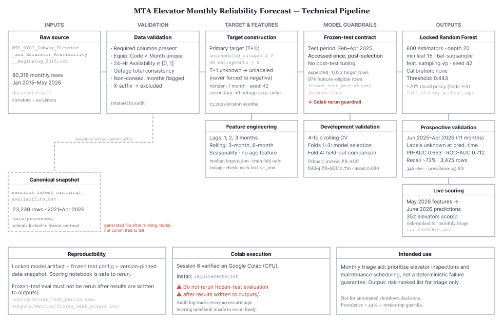

# NYC Subway Elevator Reliability Map

[](https://nycsubwayelevators.com)

A broken subway elevator - an inconvenience to some, a blocked way home for others.

In *"The Biggest Obstacle"* (Gearóid Dolan, 2021), activist and wheelchair user Dustin Jones recites a long list of subway stations he refuses to go to, after repeated experiences of being stranded by broken elevators. That struck me as a remarkable risk model, built over years of hard-earned memory.

This project is a start at turning that kind of knowledge into something more open and shareable, driven by measurable data, instead of dependent on having already been failed.

**[→ Explore the live map](https://nycsubwayelevators.com)**

*Independent project using public MTA data. Not affiliated with the MTA.*

---

## What it does

A Random Forest model scores 352 NYC subway elevators by their likelihood of failing in the coming month. "Failure" means an entrapment or two or more unscheduled outages. Every prediction is plotted on an interactive WebGL map — click any elevator to see its risk score, the reliability signals behind it, and nearby alternatives for backup route planning.

This is a planning and chronic-reliability layer, not a real-time trip tool. MTA's live feed tells you whether an elevator is broken right now; this model captures persistent degradation (the pattern of an elevator that keeps failing).

---

## How it works



**Data:** Monthly elevator availability records from the MTA, sourced from [data.ny.gov](https://data.ny.gov/Transportation/MTA-NYCT-Subway-Elevator-and-Escalator-Availabilit/rc78-7x78/about_data) (`rc78-7x78`), through May 2026.

**Target:** For each elevator-month, the model predicts whether the next month will include an entrapment or two or more unscheduled outages.

**Model:** Random Forest, trained on operational history features (outage rates, availability trends, seasonal patterns). Equipment age is deliberately excluded — it isn't a reliable predictor in this dataset.

**Performance:** Validated at ~72% recall (64–78% across eleven months, June 2025–April 2026) on historical predictions. ROC-AUC ~0.71, PR-AUC ~0.65. The current June 2026 scores are forecasts and not yet gradeable — June outcomes won't be in MTA's data until the next cycle.

**Threshold vs. display:** The map highlights the highest-confidence predictions (≥0.65) for visual clarity, showing 63 high-risk and 136 medium-risk elevators. The model's actual decision threshold is 0.443, which flags 199 elevators and is the basis for all reported performance.

---

## Limitations and future work

- **Data lag:** MTA records are published monthly; the model can only score what's been reported.
- **Reporting reliance:** The training labels come from MTA's own maintenance records. Whatever goes unreported doesn't get learned.
- **Historical-only recall:** The ~72% figure describes past predictions with known outcomes. The live June 2026 batch is ungraded until outcomes are published.
- **Cold start:** 28 of the 352 scored elevators weren't in the training cohort; 4 have exactly the minimum history window (6 months). Their scores carry more uncertainty.
- **Crowdsourced rider reporting** would add a different and important vantage point — ground truth from the people the system fails, not just what gets logged.
- **317 stations have no elevator at all.** The model can only work with what exists.

This is a start at treating access as something measurable and plannable — not just something to react to.

---

## Run it yourself

The full data processing → model → scoring pipeline is open source and designed to be reproducible.

### Option 1: Google Colab (recommended)

[](https://colab.research.google.com/github/jiayili6812/mta-elevator-risk/blob/main/notebooks/colab_runner.ipynb)

The notebook clones the repo, downloads the locked model artifact, runs validation, prospective evaluation, and generates the latest risk scores. See [COLAB_COMPATIBILITY.md](COLAB_COMPATIBILITY.md) for full instructions and how to run with newer MTA data.

### Option 2: Local

```bash
python -m pip install -r requirements.txt
python -m pip install -e .
```

Download `final_random_forest.joblib` from this project's GitHub Release assets and place it at `outputs/models/final_random_forest.joblib`, then:

```bash
python -m pytest
python -m mta_elevator_pipeline.run_pipeline validate
python -m mta_elevator_pipeline.run_pipeline session6
python -m mta_elevator_pipeline.run_pipeline session7
```

Do not run `final-evaluate` as part of normal reproduction — the frozen-test evaluation is a one-time guarded path.

---

## Repository structure

```
data/                    Data snapshots and provenance notes
notebooks/               Colab reproducibility notebook
outputs/metrics/         Prospective and frozen-test evaluation metrics
outputs/predictions/     Risk score outputs
outputs/reports/         Model card and backend summary
src/                     Pipeline package
tests/                   Unit and guardrail tests
```

See [data/README.md](data/README.md) for data provenance and field definitions.

---

*Special thanks to Alex Elegudin (CEO of Wheeling Forward, former MTA Chief Accessibility Officer) for early insight into the realities of running transit at scale, and to Gearóid Dolan, whose documentary inspired this project.*